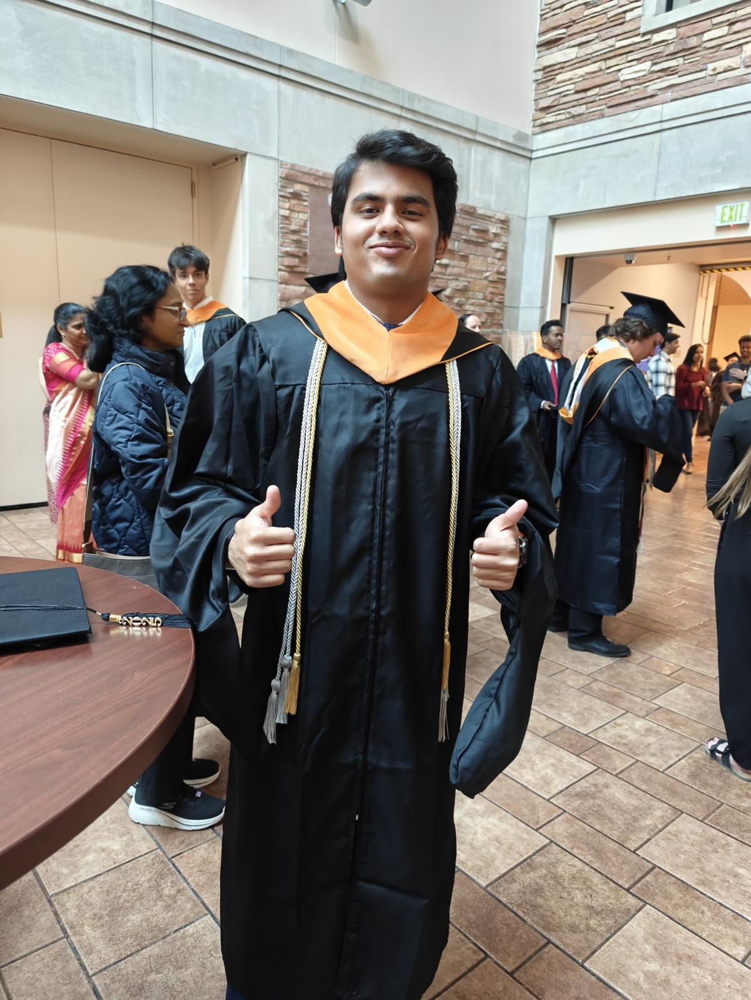

# Harish's Portfolio

### Myself 

 

👋 Hi, I'm Harish — a Data Scientist & AI Engineer passionate about building intelligent, real-world solutions.

I specialize in designing and deploying scalable machine learning systems, real-time data pipelines, and AI-powered applications that drive impact. With a strong foundation in Python, cloud platforms, and predictive modeling, I enjoy working at the intersection of data, technology, and human behavior.

From developing recommendation engines and deploying gRPC microservices to designing real-time IoT alert systems, I thrive on turning complex datasets into actionable insights. I’m especially interested in responsible AI, digital wellness, and leveraging technology to solve socially meaningful problems.

Whether it’s solving a technical challenge or collaborating across teams, I bring a curious mindset, a builder’s mentality, and a passion for continuous learning to everything I do.

#### you can view my resume here : 

[Resume](https://drive.google.com/file/d/1MO0_a_mMnWrTATC76qMhG06ZDTMf0efC/view?usp=sharing)

#### Contact:

- [LinkidIn](https://www.linkedin.com/in/harishreddypanati/)     

- [Email](harishreddypanati007@gmail.com) : harishreddypanati007@gmail.com 

Here is a quick snapshot of my work in the data field, showing off my skills and know-how in this area.

**Table of Contens :**
- [Data Engineering](https://github.com/le0stel0n/Harish-Reddy-Portfolio?tab=readme-ov-file#-data-engineering)
- [Python: Data Analysis and Machine Learning](https://github.com/le0stel0n/Harish-Reddy-Portfolio?tab=readme-ov-file#-python-data-analysis-and-machine-learning)

- [Completed Course and Certification](https://github.com/le0stel0n/Harish-Reddy-Portfolio/blob/main/README.md#-completed-courses-and-degree)

 
 

### 📂 Data Engineering

Project Link | Associated | Tools | Project Description
---|---|---|---
 [IOT Data processing and real time alert system](https://github.com/le0stel0n/IoT-Data-Processing-and-Real-Time-Alert-System) | CU Boulder | Python, GCP(Google Cloud Storage, BigQuery), Spark, Kafka, Hadoop, Influx DB, Docker, Looker Studio | Developed and Implemented a real-time IoT data processing and alert system that simulates, ingests, processes, and visualizes sensor data using a modern, modular pipeline. It leverages Apache Kafka for data ingestion, Apache Spark for transformation and aggregation, and InfluxDB for time-series storage. A FastAPI backend exposes RESTful endpoints for accessing processed data, while RabbitMQ manages real-time alerts triggered by custom conditions (e.g., high temperature). The system is visualized using Streamlit, which displays dashboards with live alerts and metrics. This project showcases a full-stack architecture for building scalable, real-time IoT applications with end-to-end data flow, automation, and monitoring.
 [AsanTe Data Scientist Intern](https://docs.google.com/document/d/1VnsQwryxLNHTOV7SCIB1P2avR4HggsBv/edit?usp=sharing&ouid=100737894925469201620&rtpof=true&sd=true) | AsanTe | Python, AWS, gRPC, Postgres SQL, Flask, Docker, Dash | As a Data Science Intern at ASANTe, I led the development of the gRPC integration for the Finder App, a platform that provides real-time access to over 1.8 million nonprofit records across the U.S. I designed and deployed a high-performance gRPC microservice that enabled filtered data retrieval with sub-100ms latency. My work included defining protobuf schemas, optimizing backend queries, and containerizing the service with Docker for scalable deployment. This integration significantly improved the app’s responsiveness and laid the groundwork for real-time analytics features.
 
 

### 📂 Python: Data Analysis and Machine Learning

Project Link | Associated | Area | Library | Project Description 
---|---|---|---|---
[Cinematch Recommendation ](https://sites.google.com/view/personalizedmovierec/cinematch/introduction?authuser=0)|CU Boulder| Data Wraggling, EDA, clustering, NNCF, Classification, NNCF, LSTM, RNN |pandas, matplotlib, seaborn, scikit-learn, scipy |Developed a hybrid recommendation engine combining collaborative filtering, deep learning embeddings, and ranking models, which improved prediction accuracy by 25% and increased user engagement by 35%. I optimized algorithms such as SVD and autoencoders to enhance recommendation relevance by 30%. Through rigorous A/B testing, the solution also led to a 12% increase in subscription retention and a 20% boost in personalized content discovery..
☎️ [Smartphoone dependency prediction](https://sites.google.com/colorado.edu/smartphonedependencyprediction/introduction)|CU Boulder|Data Wraggling, EDA, Supervised Learning - **Classification**, Real world Survey, text mining| pandas, matplotlib, seaborn, scikit-learn, shap | This project investigates the impact of smartphone dependency on physical and mental health using a dataset derived from a questionnaire. By applying key machine learning techniques—including Regression, SVM, Decision Trees, Naive Bayes, Clustering, and Association Rule Mining (ARM)—the goal was to uncover behavioral patterns, identify risk factors, and develop predictive models for excessive screen time. The analysis revealed correlations between smartphone use and symptoms like eye strain, sleep disruption, and anxiety, particularly among youth. These insights aim to support data-driven recommendations for healthier digital habits and personalized screen time interventions.

 
 

### 📂 Completed Courses and Degree

- [Master's of Science in Data Science ](https://drive.google.com/file/d/1TmRK_K2bvpqF7N6OWUtKA6zoWwVDB8CF/view?usp=sharing) | University of Colorado Boulder 2025 (GPA: 3.9)

    
- [Bachelor's of Technology and Sciences](https://drive.google.com/file/d/1cJ0FRN3sq9GSrCKpCems4U5RBtw6lnOX/view?usp=sharing) | Karunya Institute of Technology and Sciences 2023 (GPA: 3.0)

by clicking the above links you'll be able to see the courses that I took.

